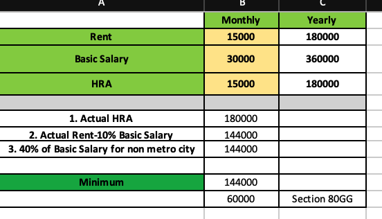
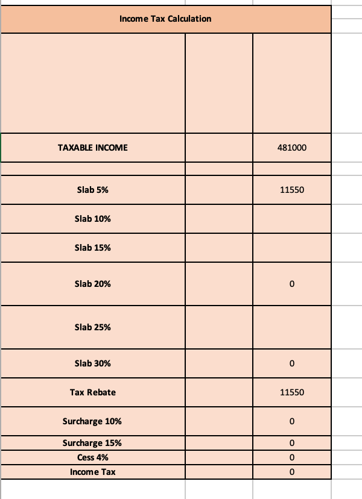

# Indian Income Tax Calculator

## 📌 Overview
This **Indian Income Tax Calculator** is an Excel-based tool designed to help individuals calculate their income tax liability based on the **Indian tax system**. The calculator allows users to input salary details, deductions, and exemptions, and it computes the total tax payable based on the latest tax slabs.

## 📂 Files in This Project
- **Income Tax Calculator-2.xlsx** – The main Excel file for tax calculation  
- **LICENSE** – Licensing information  
- **documentation/** – Folder containing images for guidance  
- **README.md** – This guide  

---

## 📝 How to Use the Excel Sheet  

### 1️⃣ Open the Excel File  
Download and open **Income Tax Calculator-2.xlsx** using:  
- **Microsoft Excel**  
- **Google Sheets**  
- **Any compatible spreadsheet application**  

### 2️⃣ Enter Your Income & Deductions  
Fill in the **highlighted input fields** in the **Income Input Section**, as shown below:  

  

You need to enter:  
✅ **Basic Salary** (Monthly & Yearly)  
✅ **HRA (House Rent Allowance)**  
✅ **Rent Paid**  
✅ **Deductions (80C, 80D, etc.)**  
✅ **Other Income (if any)**  

### 3️⃣ Tax Calculation Process  
The sheet automatically computes:  
- **HRA Exemption (for old regime)**  
- **Taxable Income**  
- **Tax as per slab rates**  
- **Rebate & Cess**  
- **Final Tax Payable**  

### 4️⃣ View Tax Calculation Output  
After entering your details, the total **income tax payable** will be displayed in the output section:  

  

---

## 🔹 Features  
✔ **Supports both Old Regimes**  
✔ **Automatic HRA Exemption Calculation**  
✔ **Section-wise Tax Calculation as per slabs**  
✔ **Tax Rebate & Surcharge Calculation**  
✔ **User-friendly, No Coding Required**  

---

## ⚠️ Important Notes  
- The calculator provides an **estimate** and should not be used as a legal tax document.  
- Always cross-check with the latest income tax rules on the official **Income Tax Department of India** website: [https://www.incometaxindia.gov.in](https://www.incometaxindia.gov.in).  

---

## 📞 Support  
If you encounter any issues, feel free to raise an issue.
